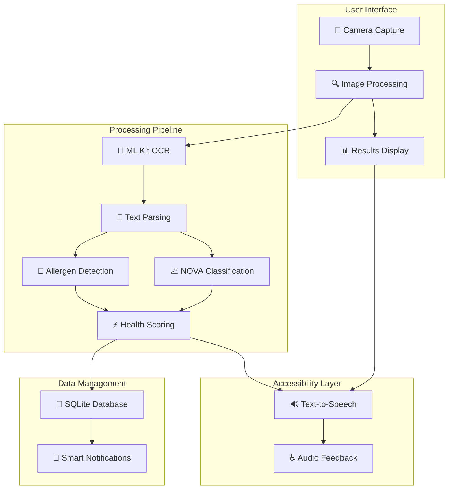

# 🍎 SmartFoods - Intelligent Food Label Analysis App

[](https://android.com)
[](https://java.com)
[](https://developers.google.com/ml-kit)

> An innovative Android application designed to enhance public health awareness and reduce food waste through intelligent food label analysis. SmartFoods leverages advanced OCR technology to scan and interpret food packaging, providing comprehensive insights about nutritional quality, safety, and sustainability.

## 🚀 Features

- ✅ **OCR Technology** - Advanced text extraction from food labels
- ✅ **Expiry Date Detection** - Automatic parsing of expiration dates
- ✅ **Allergen Detection** - Identifies nuts, dairy, gluten, and more
- ✅ **NOVA Classification** - Food processing level analysis
- ✅ **Health Score Bar** - Color-coded visual health assessment
- ✅ **Text-to-Speech** - Complete accessibility support
- ✅ **Smart Notifications** - Expiry reminders and safety alerts
- ✅ **Sustainability Impact** - Contributes to SDG 3 & 12

## 🌟 Overview

SmartFoods empowers users to make informed food choices by analyzing packaged foods in real-time. The app scans expiry dates and ingredient lists, identifies potential health risks, and provides accessibility features for inclusive usage. By promoting responsible consumption habits, SmartFoods directly contributes to **UN Sustainable Development Goals (SDG) 3: Good Health and Well-being** and **SDG 12: Responsible Consumption and Production**.

## 🏗️ Architecture



## 🎯 NOVA Food Classification

| Group | Description | Health Score | Examples |
|-------|-------------|--------------|----------|
| **Group 1** | Unprocessed/Minimally Processed | 🟢 80-100 | Fresh fruits, vegetables, grains |
| **Group 2** | Processed Culinary Ingredients | 🟡 60-79 | Oils, butter, sugar, salt |
| **Group 3** | Processed Foods | 🟠 40-59 | Canned vegetables, cheese, bread |
| **Group 4** | Ultra-processed Foods | 🔴 0-39 | Soft drinks, snacks, ready meals |

## 📋 Prerequisites

- **Android Version**: API level 21 (Android 5.0) or higher
- **Hardware Requirements**:
  - Camera with autofocus capability
  - Minimum 3GB RAM recommended
  - 100MB available storage space
- **Permissions**:
  - Camera access for label scanning
  - Storage access for saving scan history
  - Microphone access for TTS functionality

## ⚡ Quick Start

### 1. Clone the Repository
```bash
git clone https://github.com/vibha2004/Dynamic-Food-Labels-App-with-Allergen-Detection.git
cd Dynamic-Food-Labels-App-with-Allergen-Detection
```

### 2. Open in Android Studio
- Launch Android Studio (version 4.0 or higher)
- Select "Open an existing Android Studio project"
- Navigate to the project directory and open

### 3. Configure Dependencies
```bash
./gradlew clean
./gradlew build
```

### 4. Set Up API Keys (if required)
Create `local.properties` file in root directory:
```properties
OCR_API_KEY="your_ocr_api_key"
TTS_API_KEY="your_tts_api_key"
```

### 5. Run the Application
- Connect Android device or start emulator
- Click "Run" in Android Studio
- Grant required permissions when prompted

## 📂 Project Structure

```
SmartFoods/
├── app/
│   ├── src/main/java/com/smartfoods/
│   │   ├── activities/
│   │   │   ├── MainActivity.java
│   │   │   ├── ScanActivity.java
│   │   │   ├── ResultsActivity.java
│   │   │   └── SettingsActivity.java
│   │   ├── adapters/
│   │   │   ├── IngredientsAdapter.java
│   │   │   └── HistoryAdapter.java
│   │   ├── database/
│   │   │   ├── SmartFoodsDatabase.java
│   │   │   ├── FoodItem.java
│   │   │   └── ScanHistory.java
│   │   ├── services/
│   │   │   ├── OCRService.java
│   │   │   ├── TTSService.java
│   │   │   └── NotificationService.java
│   │   ├── utils/
│   │   │   ├── AllergenDetector.java
│   │   │   ├── NOVAClassifier.java
│   │   │   ├── HealthScoreCalculator.java
│   │   │   └── ExpiryDateParser.java
│   │   └── models/
│   │       ├── FoodAnalysis.java
│   │       ├── Ingredient.java
│   │       └── HealthScore.java
│   └── src/main/res/
│       ├── layout/          # UI layouts
│       ├── values/          # Strings, colors, dimensions
│       ├── drawable/        # Icons and graphics
│       └── raw/             # TTS audio files
```

## 🔍 Key Features

### 🚨 Health & Safety Analysis
- **Allergen Detection**: Identifies and highlights potential allergens including:
  - Nuts (peanuts, tree nuts)
  - Dairy products
  - Gluten/Wheat
  - Eggs, Soy, Shellfish, Fish
  - Sesame and other common allergens
- **Harmful Additives Identification**: Detects potentially harmful food additives and preservatives
- **Artificial Flavoring Detection**: Highlights artificial flavorings and synthetic ingredients

### 📊 Visual Health Assessment
- **Dynamic Health Score Bar**: Color-coded visual representation of nutritional quality
  - 🟢 **Green**: Healthy, minimally processed
  - 🟡 **Yellow**: Moderate processing, some concerns
  - 🟠 **Orange**: Highly processed, multiple additives
  - 🔴 **Red**: Ultra-processed, potential health risks
- **Expiry Status Indicators**: Visual alerts for product freshness and safety
- **Real-time Processing**: Instant analysis and feedback

### ♿ Accessibility Features
- **Text-to-Speech (TTS)**: Complete voice narration for visually impaired users
- **Audio Feedback**: Spoken alerts for allergens and health warnings
- **Voice-guided Navigation**: Audio instructions for app usage
- **High Contrast Mode**: Enhanced visibility options

### 📱 Smart Notifications
- **Grouped Notifications**: Organized alerts for different categories
- **Expiry Reminders**: Proactive notifications about expiring items
- **Safety Alerts**: Immediate warnings for harmful ingredients
- **Customizable Preferences**: User-controlled notification settings

## 📱 How to Use SmartFoods

### Initial Setup
1. **Launch the App** and complete the welcome tour
2. **Set Personal Preferences**:
   - Select your allergies and dietary restrictions
   - Configure notification preferences
   - Enable accessibility features if needed
3. **Grant Permissions** for camera, storage, and microphone access

### Scanning Food Products
1. **Position the Camera** over the food label
2. **Ensure Good Lighting** and clear text visibility
3. **Tap Scan Button** or use auto-detection mode
4. **Wait for Analysis** (typically 2-5 seconds)
5. **Review Results** on the analysis screen

## 🛠️ Core Technologies

- **Android SDK**: Native Android development
- **OCR Engine**: Google ML Kit Text Recognition API
- **Text-to-Speech**: Android TTS Engine
- **Database**: SQLite for local data storage
- **Image Processing**: OpenCV for image enhancement
- **Machine Learning**: TensorFlow Lite for ingredient classification

## 🧪 Testing

### Run Tests
```bash
# Unit Tests
./gradlew test

# Integration Tests
./gradlew connectedAndroidTest

# UI Automation Tests
./gradlew connectedDebugAndroidTest

# Accessibility Tests
./gradlew testDebugUnitTest --tests "*AccessibilityTest*"
```

### Test Coverage Areas
- **OCR Accuracy**: Various lighting conditions and label formats
- **Allergen Detection**: Comprehensive ingredient database testing
- **TTS Functionality**: Voice output quality and timing
- **NOVA Classification**: Processing level accuracy
- **Health Score Calculation**: Algorithm validation
- **Accessibility Compliance**: Screen reader compatibility

## 🌍 Impact & Sustainability

### SDG 3: Good Health and Well-being
- **Health Awareness**: Educates users about food additives and processing
- **Allergen Safety**: Prevents allergic reactions through early detection
- **Nutritional Guidance**: Promotes healthier food choices
- **Accessibility**: Ensures inclusive health information access

### SDG 12: Responsible Consumption and Production
- **Food Waste Reduction**: Tracks expiry dates to minimize waste
- **Conscious Purchasing**: Encourages informed buying decisions
- **Processing Awareness**: Highlights environmental impact of food production
- **Sustainable Habits**: Promotes long-term behavioral change

## 🔧 Configuration

### User Preferences
```java
// Example configuration options
SharedPreferences prefs = getSharedPreferences("SmartFoodsPrefs", MODE_PRIVATE);
prefs.edit()
    .putBoolean("tts_enabled", true)
    .putBoolean("allergen_alerts", true)
    .putInt("notification_frequency", 3) // hours
    .putStringSet("user_allergens", allergenSet)
    .apply();
```

### Accessibility Settings
- **TTS Speed**: Adjustable speech rate (0.5x to 2.0x)
- **Voice Selection**: Multiple TTS voice options
- **High Contrast**: Enhanced visual accessibility
- **Large Text**: Scalable font sizes
- **Audio Cues**: Sound feedback for interactions

## 🤝 Contributing

We welcome contributions from developers, nutritionists, and accessibility experts!

### Development Areas
- **OCR Improvements**: Enhanced text recognition accuracy
- **Allergen Database**: Expanded ingredient identification
- **UI/UX Enhancement**: Better user experience design
- **Accessibility Features**: Additional inclusive features
- **Localization**: Multi-language support
- **Performance Optimization**: Faster processing algorithms

### Contribution Process
1. **Fork** the repository
2. **Create Feature Branch**: `git checkout -b feature/AmazingFeature`
3. **Implement Changes**: Follow coding standards
4. **Add Tests**: Ensure comprehensive test coverage
5. **Update Documentation**: Reflect changes in README
6. **Submit Pull Request**: Detailed description of changes

### Code Standards
- **Java/Kotlin**: Follow Android development best practices
- **Documentation**: Comprehensive JavaDoc comments
- **Testing**: Unit tests for all new features
- **Accessibility**: WCAG 2.1 AA compliance
- **Performance**: Memory and battery optimization

## ⚠️ Important Disclaimers

### Medical Disclaimer
SmartFoods is designed to assist with food ingredient identification and should **not replace professional medical advice**. Users with severe allergies should:
- Always verify ingredient information manually
- Consult healthcare providers for medical guidance
- Carry prescribed emergency medications (EpiPen, etc.)
- Use the app as a supplementary tool, not primary safety measure

### Privacy & Data
- **Local Processing**: Most analysis occurs on-device
- **No Personal Health Data**: App doesn't store sensitive medical information
- **Anonymous Usage**: Analytics data is anonymized and aggregated
- **User Control**: Full control over data sharing and storage preferences

## 🏆 Acknowledgments

### Special Thanks
- **Google ML Kit Team** - OCR and text recognition APIs
- **OpenCV Community** - Image processing libraries
- **Android Accessibility Team** - TTS and accessibility guidelines
- **NOVA Classification Researchers** - Food processing classification system
- **Open Source Contributors** - Various libraries and tools
- **Reference Repository** - ravk1234/OCR-Food-ingredients-

---

<div align="center">
  <strong>Enhancing Public Health Through Intelligent Food Analysis</strong> 🍎📱🌍
</div>
